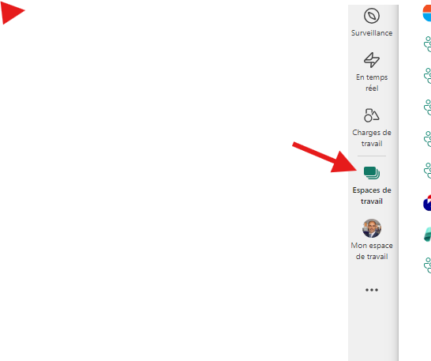

# Real-Time Intelligence tutorial part 1: Create resources

In this part of the tutorial, you set up the environment. Specifically, you use a Fabric dedicated *workspace* and create an *eventhouse*, which automatically creates a child KQL database, and then you enable OneLake availability.

## using a workspace
1. Open a web browser and browse to https://app.fabric.microsoft.com.

2. When prompted, sign in using the credentials we gave to you:
    * **Email**
    * **Password**

3. Choose **Real-Time Intelligence** from the list of options on the home page or the menu bar on the bottom left of the portal.

    

4. Select **Workspaces** from the left navigation pane. Then select the workspace available for the labs.

    

## Create an eventhouse

1. Ensure that there is a diamond icon next to the workspace name, which indicates that the workspace is associated with a Fabric Capacity.

    

    If the diamond icon is not present, select **Workspace Settings** >  **License Info**. On the License Configuration tile, Select the **Edit**, under License Mode select **Trial**  and finally select *Select License*.

2. On the bottom left experience switcher, select **Real-Time Intelligence**.

3. In upper right corner under recommended items to create select **Eventhouse**.

    

4. Enter +++*Tutorial*+++ as the eventhouse name. A KQL database will be created simultaneously with the same name.

5. Select **Create**. When provisioning is complete, Select **Get started** and the eventhouse **System overview** page is shown.

## Turn on OneLake availability

1. From the **System overview** page, select the KQL database which was created in the previous step.

    

2. In the **Database details** section, toggle OneLake Availability to **On**. In the confirmation dialog ensure **Apply to existing tables is checked**  and select **Turn on**.

    

## Next step

> Select **Next >** in these instructions to go to the next part of the tutorial: Get data in the Real-Time hub.